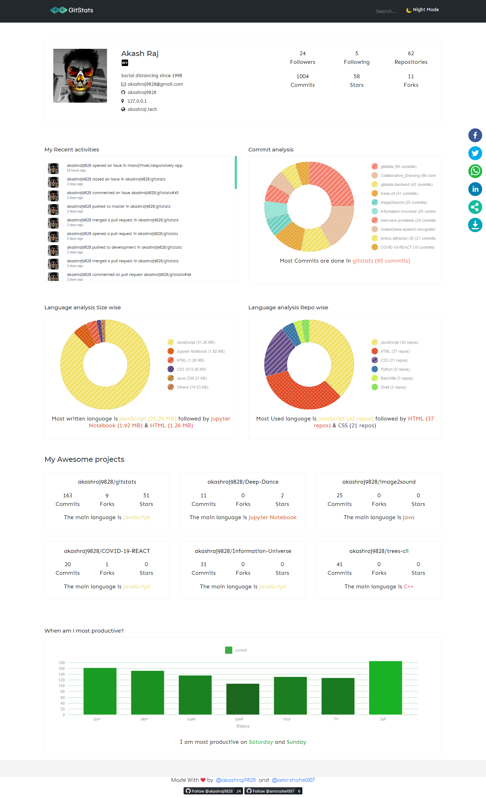

----
<!-- # GitStats - An open-source GitHub contibution analyzer  -->

[](https://travis-ci.com/akashraj9828/gitstats)

[](https://codesandbox.io/s/github/akashraj9828/gitstats/tree/master/?fontsize=14&hidenavigation=1&theme=dark)

## Contributors  <a href="https://github.com/akashraj9828/gitstats/graphs/contributors">
  
 </a>


# Available Scripts

In the project directory, you can run:

## Before you begin
`npm install`

This installs all dependencies required by the project. <br />

## For the developers:
`npm run dev`

## To prettify the code:
`npm run pretty`

This allows you to run this repo in the development environment, where you can make changes as well and see it get updated __live__. <br />
 
## For the end users.
```bash
npm run build
npm start
```

The first command correctly bundles React in production mode and optimizes the build for the best performance. The second command allows you to serve this static file through a node server. <br/>

# Sample Screen


